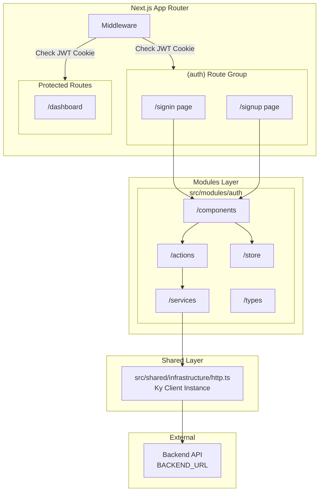

# Design Document: Authentication System

## Overview

This design document describes the architecture and implementation of the authentication system for the ERP frontend application. The system provides signup and signin functionality using JWT-based authentication with cookie storage, following Next.js App Router patterns with server components where possible.

The authentication flow uses:
- **Ky HTTP Client** for API communication with the backend
- **Zod** for schema validation at all IO boundaries
- **Zustand** for client-side auth state management
- **Shadcn Form** for accessible, responsive form components
- **Next.js Middleware** for route protection and redirects

## Architecture



## Components and Interfaces

### Infrastructure Layer

#### `src/shared/infrastructure/http.ts`
Centralized Ky client instance configured with the backend URL.

```typescript
interface HttpClientConfig {
  prefixUrl: string;  // From BACKEND_URL env variable
  timeout: number;
  hooks: {
    beforeError: BeforeErrorHook[];
  };
}
```

### Module Layer: Auth

#### Types (`src/modules/auth/types/`)

```typescript
// schemas.ts - Zod schemas for validation
const signupSchema = z.object({
  name: z.string().min(1, "Name is required"),
  email: z.string().email("Invalid email format"),
  password: z.string().min(6, "Password must be at least 6 characters"),
});

const signinSchema = z.object({
  email: z.string().email("Invalid email format"),
  password: z.string().min(1, "Password is required"),
});

const tokensResponseSchema = z.object({
  access: z.string(),
  refresh: z.string(),
});

const errorResponseSchema = z.object({
  message: z.string(),
  issues: z.array(z.object({
    code: z.string(),
    message: z.string(),
    path: z.array(z.union([z.string(), z.number()])),
  })).optional(),
});

// Inferred types
type SignupInput = z.infer<typeof signupSchema>;
type SigninInput = z.infer<typeof signinSchema>;
type TokensResponse = z.infer<typeof tokensResponseSchema>;
type ErrorResponse = z.infer<typeof errorResponseSchema>;
```

#### Services (`src/modules/auth/services/`)

```typescript
// auth-service.ts
interface AuthService {
  signup(data: SignupInput): Promise<TokensResponse>;
  signin(data: SigninInput): Promise<TokensResponse>;
  signout(refreshToken: string): Promise<void>;
  refresh(refreshToken: string): Promise<TokensResponse>;
}
```

#### Actions (`src/modules/auth/actions/`)

Server Actions for form submission handling:

```typescript
// signup-action.ts
async function signupAction(formData: FormData): Promise<ActionResult>;

// signin-action.ts  
async function signinAction(formData: FormData): Promise<ActionResult>;

// signout-action.ts
async function signoutAction(): Promise<void>;
```

#### Store (`src/modules/auth/store/`)

```typescript
// use-auth-store.ts
interface AuthState {
  isAuthenticated: boolean;
  setAuthenticated: (value: boolean) => void;
  clearAuth: () => void;
}
```

#### Components (`src/modules/auth/components/`)

- `signin-form.tsx` - Client component with Shadcn Form for signin
- `signup-form.tsx` - Client component with Shadcn Form for signup

### App Layer

#### Route Group: `src/app/(auth)/`

- `layout.tsx` - Shared layout for auth pages (centered card design)
- `signin/page.tsx` - Server component rendering SigninForm
- `signup/page.tsx` - Server component rendering SignupForm

#### Middleware: `src/middleware.ts`

Route protection logic checking JWT cookie presence.

## Data Models

### Cookie Storage

| Cookie Name | Value | HttpOnly | Secure | SameSite | Path |
|-------------|-------|----------|--------|----------|------|
| `access_token` | JWT access token | Yes | Production only | Lax | / |
| `refresh_token` | JWT refresh token | Yes | Production only | Lax | / |

### Form State

```typescript
interface FormState {
  errors: Record<string, string[]>;
  message: string | null;
  success: boolean;
}
```

## Correctness Properties

*A property is a characteristic or behavior that should hold true across all valid executions of a system-essentially, a formal statement about what the system should do. Properties serve as the bridge between human-readable specifications and machine-verifiable correctness guarantees.*

Based on the prework analysis, the following properties have been identified for property-based testing:

### Property 1: Valid signup credentials pass validation
*For any* signup input with a non-empty name, valid email format, and password of 6+ characters, the Zod schema validation SHALL pass without errors.
**Validates: Requirements 1.1, 1.3, 1.4**

### Property 2: Invalid email format fails validation
*For any* string that does not match email format (missing @, invalid domain, etc.), the signup and signin Zod schemas SHALL reject with an email validation error.
**Validates: Requirements 1.3**

### Property 3: Short passwords fail validation
*For any* password string with length less than 6 characters, the signup Zod schema SHALL reject with a minimum length error.
**Validates: Requirements 1.4**

### Property 4: Unauthenticated users are redirected from protected routes
*For any* protected route path and request without a valid JWT cookie, the middleware SHALL redirect to the signin page.
**Validates: Requirements 3.1**

### Property 5: Authenticated users are redirected from auth pages
*For any* auth page path (signin, signup) and request with a valid JWT cookie, the middleware SHALL redirect to the dashboard.
**Validates: Requirements 3.2**

### Property 6: API error messages are extracted correctly
*For any* HTTPError response with a JSON body containing a message field, the error handler SHALL extract and return that message.
**Validates: Requirements 5.3**

### Property 7: Token response round-trip validation
*For any* valid TokensResponse object, serializing to JSON and parsing back through the Zod schema SHALL produce an equivalent object.
**Validates: Requirements 4.2, 5.5**

### Property 8: Auth store updates on signin
*For any* successful signin action, the auth store's isAuthenticated state SHALL be set to true.
**Validates: Requirements 7.1**

### Property 9: Auth store clears on signout
*For any* signout action, the auth store's isAuthenticated state SHALL be set to false and all auth data cleared.
**Validates: Requirements 7.2**

## Error Handling

### Client-Side Validation Errors
- Zod validation errors are mapped to form field errors
- Displayed inline below respective input fields using Shadcn Form's error display

### API Errors
- HTTPError responses are caught and parsed
- Error messages extracted from response body
- Displayed as form-level error messages

### Network Errors
- Ky timeout and network errors caught
- Generic error message displayed to user
- Console logging for debugging

### Error Response Format
```typescript
interface ActionResult {
  success: boolean;
  message?: string;
  errors?: Record<string, string[]>;
}
```

## Testing Strategy

### Property-Based Testing Library
**fast-check** will be used for property-based testing in TypeScript/JavaScript.

### Unit Tests
- Zod schema validation for edge cases
- Auth service function mocking
- Store state transitions

### Property-Based Tests
Each correctness property will be implemented as a property-based test using fast-check:

- Tests MUST be annotated with: `**Feature: auth, Property {number}: {property_text}**`
- Each property test MUST run a minimum of 100 iterations
- Generators will create random valid/invalid inputs based on the property being tested

### Integration Tests
- Server action form submission flows
- Middleware redirect behavior
- Cookie setting/clearing

### Test File Structure
```
src/modules/auth/
├── __tests__/
│   ├── schemas.test.ts        # Schema validation tests
│   ├── schemas.property.ts    # Property-based tests for schemas
│   ├── auth-service.test.ts   # Service unit tests
│   ├── middleware.test.ts     # Middleware tests
│   └── store.test.ts          # Store state tests
```
