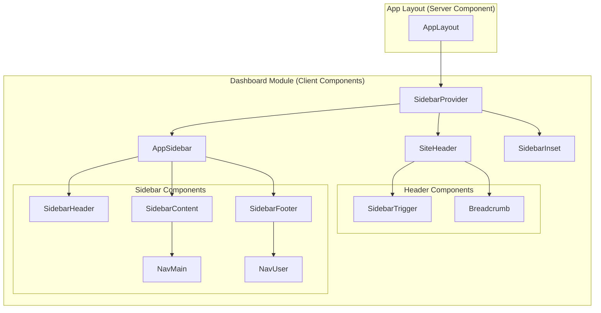

# Design Document: Dashboard Layout

## Overview

The dashboard layout provides a consistent navigation structure for all authenticated routes in the ERP system. It consists of two main components: a sticky header with navigation controls and a collapsible sidebar for primary navigation. The implementation leverages shadcn UI's sidebar component system, which provides built-in support for responsive behavior, accessibility, and state management.

The layout follows a mobile-first approach where the sidebar renders as an overlay on small screens and as a persistent panel on larger screens. The header remains sticky at the top and includes a sidebar toggle, breadcrumb navigation, and search functionality.

## Architecture



### Component Hierarchy

1. **AppLayout** (Server Component) - Wraps authenticated routes with the dashboard structure
2. **SidebarProvider** (Client) - Manages sidebar open/collapsed state via React context
3. **SiteHeader** (Client) - Sticky header with toggle button and breadcrumbs
4. **AppSidebar** (Client) - Main sidebar with navigation and user profile
5. **SidebarInset** - Content area that adjusts based on sidebar state

## Components and Interfaces

### Module Structure

```
src/modules/dashboard/
├── components/
│   ├── app-sidebar.tsx      # Main sidebar component
│   ├── site-header.tsx      # Sticky header component
│   ├── nav-main.tsx         # Primary navigation menu
│   └── nav-user.tsx         # User profile dropdown
├── constants/
│   └── navigation-config.ts # Navigation menu configuration
└── types/
    └── navigation.ts        # Navigation type definitions
```

### Component Interfaces

```typescript
// types/navigation.ts
import { type LucideIcon } from "lucide-react";

export interface NavItem {
  title: string;
  url: string;
  icon: LucideIcon;
  isActive?: boolean;
  items?: NavSubItem[];
}

export interface NavSubItem {
  title: string;
  url: string;
}

export interface UserInfo {
  name: string;
  email: string;
  avatar?: string;
}
```

### SiteHeader Component

```typescript
// components/site-header.tsx
interface SiteHeaderProps {
  breadcrumbs?: BreadcrumbItem[];
}

interface BreadcrumbItem {
  label: string;
  href?: string;
}
```

The header component:
- Renders a sticky header at the top of the viewport
- Contains a sidebar toggle button (SidebarTrigger from shadcn)
- Displays breadcrumb navigation on screens ≥640px
- Uses the `useSidebar` hook to access toggle functionality

### AppSidebar Component

```typescript
// components/app-sidebar.tsx
interface AppSidebarProps extends React.ComponentProps<typeof Sidebar> {
  user: UserInfo;
  navItems: NavItem[];
}
```

The sidebar component:
- Renders below the header with adjusted height
- Contains SidebarHeader with app branding
- Contains SidebarContent with NavMain navigation
- Contains SidebarFooter with NavUser profile

### NavMain Component

```typescript
// components/nav-main.tsx
interface NavMainProps {
  items: NavItem[];
}
```

The navigation component:
- Renders collapsible menu items with icons
- Supports nested sub-items with Collapsible component
- Shows tooltips when sidebar is collapsed

### NavUser Component

```typescript
// components/nav-user.tsx
interface NavUserProps {
  user: UserInfo;
}
```

The user profile component:
- Displays user avatar, name, and email
- Provides dropdown menu with account options
- Includes sign out action integration

## Data Models

### Navigation Configuration

```typescript
// constants/navigation-config.ts
import { LayoutDashboard, Users, Settings, HelpCircle } from "lucide-react";
import type { NavItem } from "../types/navigation";

export const mainNavItems: NavItem[] = [
  {
    title: "Dashboard",
    url: "/",
    icon: LayoutDashboard,
    isActive: true,
  },
  {
    title: "Users",
    url: "/users",
    icon: Users,
    items: [
      { title: "All Users", url: "/users" },
      { title: "Roles", url: "/users/roles" },
    ],
  },
  {
    title: "Settings",
    url: "/settings",
    icon: Settings,
    items: [
      { title: "General", url: "/settings" },
      { title: "Security", url: "/settings/security" },
    ],
  },
];

export const secondaryNavItems: NavItem[] = [
  {
    title: "Help",
    url: "/help",
    icon: HelpCircle,
  },
];
```

## Correctness Properties

*A property is a characteristic or behavior that should hold true across all valid executions of a system-essentially, a formal statement about what the system should do. Properties serve as the bridge between human-readable specifications and machine-verifiable correctness guarantees.*

Based on the prework analysis, the following properties can be verified through property-based testing:

### Property 1: Sidebar Toggle Round-Trip

*For any* initial sidebar state (open or collapsed), toggling the sidebar twice SHALL return it to the original state.

**Validates: Requirements 1.4**

### Property 2: Navigation Items Render Completely

*For any* valid navigation configuration, when the sidebar is expanded, each navigation item SHALL render with both its icon and label visible.

**Validates: Requirements 2.3**

### Property 3: Navigation Click Triggers Route

*For any* navigation item with a URL, clicking that item SHALL trigger navigation to the corresponding route.

**Validates: Requirements 2.5**

### Property 4: User Info Display Completeness

*For any* valid user object with name and email, the NavUser component SHALL display both the name and email in the rendered output.

**Validates: Requirements 3.1**

## Error Handling

### Missing User Data

When user information is not available:
- Display a placeholder avatar with initials "??"
- Show "Guest" as the name
- Hide the email field
- Disable account-related dropdown options

### Navigation Errors

When navigation fails:
- Log the error to console in development
- Show a toast notification to the user
- Maintain the current page state

### Context Errors

When SidebarProvider context is missing:
- Components should throw a descriptive error during development
- The error message should indicate the component must be wrapped in SidebarProvider

## Testing Strategy

### Property-Based Testing

The project will use **fast-check** for property-based testing in TypeScript/React.

Configuration:
- Minimum 100 iterations per property test
- Tests tagged with format: `**Feature: dashboard, Property {number}: {property_text}**`

Property tests will focus on:
1. Sidebar state toggle consistency (round-trip)
2. Navigation item rendering completeness
3. User info display completeness

### Unit Testing

Unit tests will cover:
- Component rendering with various props
- Event handler invocations
- Context value consumption

### Integration Testing

Integration tests (optional) will verify:
- Layout composition with child routes
- Responsive behavior at breakpoints
- Navigation flow between pages

### Test File Structure

```
src/modules/dashboard/
├── __tests__/
│   ├── app-sidebar.test.tsx
│   ├── site-header.test.tsx
│   ├── nav-main.test.tsx
│   ├── nav-user.test.tsx
│   └── properties.test.tsx    # Property-based tests
```
