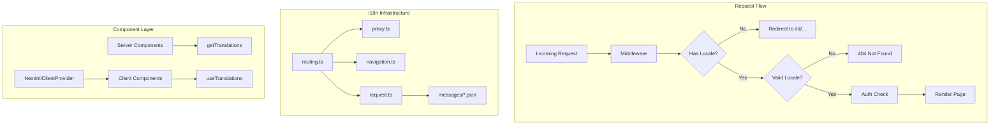

# Design Document: i18n (Internationalization)

## Overview

This design document outlines the implementation of internationalization (i18n) for the ERP System Frontend using `next-intl` library. The system will support Indonesian (id) as the primary language and English (en) as the secondary language, with locale-based URL routing and seamless integration with the existing authentication middleware.

The implementation follows Next.js App Router patterns with the `[locale]` dynamic segment approach, enabling clean URLs like `/id/signin` and `/en/dashboard`.

## Architecture



## Components and Interfaces

### 1. Routing Configuration (`src/i18n/routing.ts`)

Centralized configuration for all i18n routing behavior.

```typescript
interface RoutingConfig {
  locales: readonly ['id', 'en'];
  defaultLocale: 'id';
  localePrefix: 'always';
}
```

### 2. Proxy (`src/proxy.ts`)

Combines next-intl locale routing with existing authentication logic using Next.js 16's proxy convention.

```typescript
// Proxy chain: i18n routing → auth validation
export default async function proxy(request: NextRequest): Promise<NextResponse>;
```

### 3. Request Configuration (`src/i18n/request.ts`)

Server-side configuration for loading locale and messages.

```typescript
interface RequestConfig {
  locale: string;
  messages: Messages;
}
```

### 4. Navigation APIs (`src/i18n/navigation.ts`)

Locale-aware navigation utilities derived from routing config.

```typescript
export const { Link, redirect, usePathname, useRouter, getPathname } = createNavigation(routing);
```

### 5. Language Switcher Component (`src/shared/components/language-switcher.tsx`)

Client component for switching between languages.

```typescript
interface LanguageSwitcherProps {
  className?: string;
}
```

## Data Models

### Translation Messages Structure

```typescript
interface Messages {
  common: {
    loading: string;
    error: string;
    success: string;
  };
  auth: {
    signin: {
      title: string;
      email: string;
      password: string;
      submit: string;
      noAccount: string;
      signupLink: string;
    };
    signup: {
      title: string;
      name: string;
      email: string;
      password: string;
      confirmPassword: string;
      submit: string;
      hasAccount: string;
      signinLink: string;
    };
    signout: string;
  };
  navigation: {
    home: string;
    dashboard: string;
  };
  errors: {
    notFound: string;
    unauthorized: string;
    serverError: string;
  };
}
```

### Locale Configuration

```typescript
type Locale = 'id' | 'en';

interface LocaleConfig {
  code: Locale;
  name: string;      // Native name
  direction: 'ltr';  // Text direction
}

const localeConfigs: Record<Locale, LocaleConfig> = {
  id: { code: 'id', name: 'Bahasa Indonesia', direction: 'ltr' },
  en: { code: 'en', name: 'English', direction: 'ltr' },
};
```

## Correctness Properties

*A property is a characteristic or behavior that should hold true across all valid executions of a system-essentially, a formal statement about what the system should do. Properties serve as the bridge between human-readable specifications and machine-verifiable correctness guarantees.*

Based on the prework analysis, the following correctness properties have been identified:

### Property 1: Default Locale Redirect

*For any* valid pathname without a locale prefix, the proxy SHALL redirect to the same pathname with the default locale ('id') prefix prepended.

**Validates: Requirements 1.1**

### Property 2: Valid Locale Acceptance

*For any* pathname with a valid locale prefix ('id' or 'en'), the proxy SHALL allow the request to proceed without redirect.

**Validates: Requirements 1.2**

### Property 3: Invalid Locale Rejection

*For any* pathname with an invalid locale prefix (not 'id' or 'en'), the system SHALL return a 404 not found response.

**Validates: Requirements 1.3, 7.2**

### Property 4: Translation Message Round-Trip

*For any* valid Messages object, serializing to JSON and parsing back SHALL produce an equivalent object.

**Validates: Requirements 3.4, 3.5**

### Property 5: Dynamic Message Loading

*For any* supported locale, requesting translations SHALL load the corresponding locale's message file.

**Validates: Requirements 3.2**

### Property 6: Translation Key Lookup

*For any* valid translation key path and locale, the translation function SHALL return the correct localized string from the loaded messages.

**Validates: Requirements 3.3**

### Property 7: Language Switch URL Generation

*For any* current pathname with query parameters and any target locale, the language switcher SHALL generate a URL that preserves the pathname and query parameters while only changing the locale prefix.

**Validates: Requirements 5.1, 5.2**

## Error Handling

### Invalid Locale Handling

- Invalid locale in URL → Render 404 page via `notFound()` from Next.js
- Missing translation key → Return key path as fallback (development warning)

### Proxy Error Handling

- i18n routing errors → Fall through to auth logic
- Auth logic errors → Redirect to signin with callback URL

### Translation Loading Errors

- Missing translation file → Fall back to default locale messages
- Malformed JSON → Log error, use empty messages object

## Testing Strategy

### Property-Based Testing Library

The implementation will use `fast-check` (already installed in the project) for property-based testing.

### Test Configuration

- Minimum 100 iterations per property test
- Each property test tagged with: `**Feature: i18n, Property {number}: {property_text}**`

### Unit Tests

Unit tests will cover:
- Routing configuration structure validation
- Navigation API exports verification
- Language switcher component rendering
- Translation message file structure

### Property-Based Tests

Each correctness property will have a corresponding property-based test:

1. **Property 1 Test**: Generate random valid pathnames, verify redirect to `/id/{pathname}`
2. **Property 2 Test**: Generate random paths with valid locale prefixes, verify no redirect
3. **Property 3 Test**: Generate random invalid locale strings, verify 404 behavior
4. **Property 4 Test**: Generate random Messages objects, verify JSON round-trip
5. **Property 5 Test**: For each supported locale, verify correct message file loading
6. **Property 6 Test**: Generate random valid key paths, verify correct string lookup
7. **Property 7 Test**: Generate random paths with query params, verify URL preservation on locale switch

### Integration Tests

- Proxy chain execution order (i18n → auth)
- Server Component translation access
- Client Component translation access via provider
- Full page render with translations

## File Structure

```
src/
├── i18n/
│   ├── routing.ts          # Routing configuration
│   ├── request.ts          # Server request config
│   └── navigation.ts       # Navigation APIs
├── proxy.ts                # Combined i18n + auth proxy (Next.js 16 convention)
├── app/
│   └── [locale]/
│       ├── layout.tsx      # Locale layout with provider
│       ├── not-found.tsx   # 404 page
│       ├── (app)/
│       │   ├── layout.tsx
│       │   └── page.tsx
│       └── (auth)/
│           ├── layout.tsx
│           ├── signin/
│           │   └── page.tsx
│           └── signup/
│               └── page.tsx
├── shared/
│   └── components/
│       └── language-switcher.tsx
messages/
├── id.json                 # Indonesian translations
└── en.json                 # English translations
```
